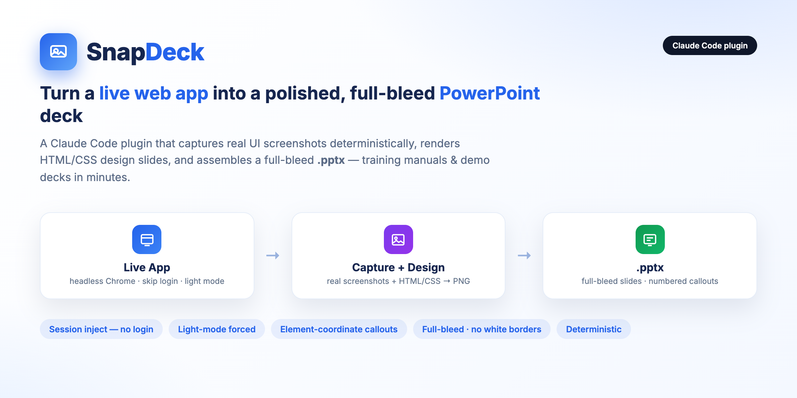
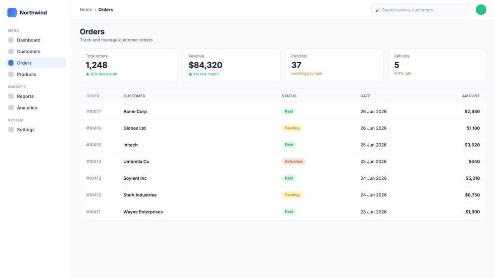
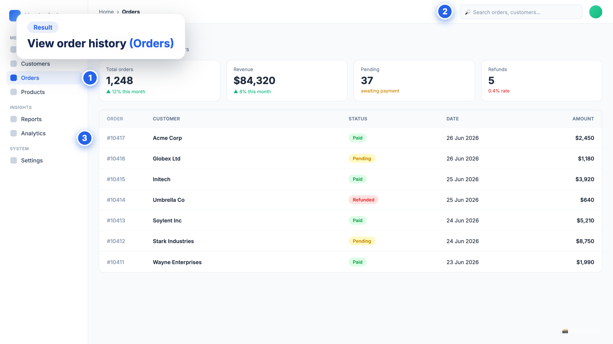

<div align="center">

# 📸 SnapDeck

**Snap a live web app into a polished, full-bleed PowerPoint deck.**



[](https://code.claude.com/docs/en/plugins)


<br>



<sub>A live app screen → a full-bleed SnapDeck slide with numbered callouts</sub>

</div>

A Claude Code plugin that turns a **running web app** into a clean training/demo deck.
It captures **real UI screenshots** deterministically via headless Chrome, renders **HTML/CSS
design slides** to PNG, and assembles everything as **full-bleed picture slides** in a `.pptx`.

## Why it's different
Most "screenshot to slides" flows are manual and inconsistent. SnapDeck is a **pipeline**:

- **Deterministic capture** — drives the live app with headless Chrome (CDP/puppeteer):
  injects your logged-in session to **skip login**, **forces light mode**, opens **modals/tabs**,
  scrolls to fields, and reads **element coordinates** so callouts land exactly on the right control.
- **Design as code** — every slide is authored in HTML/CSS and rendered to a crisp PNG (pixel
  control over shadows, gradients, fonts, framed screenshots) — not fragile pptx textboxes.
- **Full-bleed output** — screenshots fill the slide edge-to-edge with compact title cards and
  **numbered step callouts** beside (never on top of) the UI.

<div align="center">



<sub>An example slide SnapDeck generated from a live app — full-bleed screenshot · title card · numbered callouts <i>(demo app shown; point it at your own)</i></sub>

</div>

## Pipeline
```
capture.js   live app  → shots/<key>.png + <key>.rects.json   (session inject · light mode · modals · element rects)
slides.py    content   → slides/<key>.html                     (full-bleed design system)
render.js    *.html    → *.png                                 (headless Chrome, dsf 2)
assemble.py  ordered PNGs → out.pptx                            (16:9, full-bleed)
```

## Install
```
# from the hosted marketplace:
/plugin marketplace add https://github.com/hacka0wi/SnapDeck
/plugin install snapdeck@snapdeck
```
Then invoke with `/snapdeck`, or just ask: *"make a training deck from the app"*,
*"recapture the screenshots"*, *"cap the screens into pptx"*.

## Requirements
- System **Google Chrome**
- **Node** (`npm i puppeteer-core` in the work dir)
- **Python** with `python-pptx` + `Pillow`

## What's inside
```
.claude-plugin/marketplace.json       # marketplace manifest
plugins/snapdeck/
  .claude-plugin/plugin.json           # plugin manifest
  skills/snapdeck/
    SKILL.md                            # the full pipeline guide + gotchas
    example-config.json                 # a worked capture config
    scripts/  lib.js capture.js slides.py render.js assemble.py build-example.py
```

## Notes
- Adapt the design system (font, colors, footer) and per-page capture config to your app.
- SnapDeck never triggers destructive actions (delete / submit / encrypt) just to get a screenshot.

---
<div align="center"><sub>Built with Claude Code · MIT licensed</sub></div>
